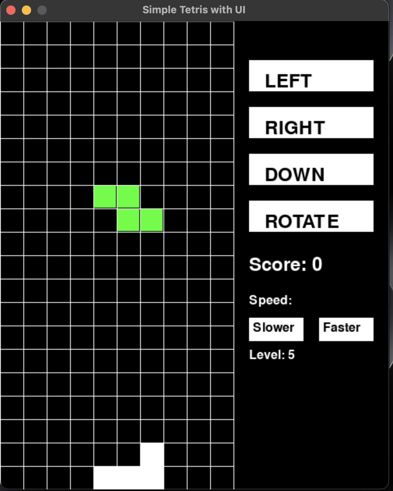

# Simple Tetris with UI

A modern implementation of the classic Tetris game built with Pygame, featuring a clean user interface and touch controls.



## Features

- Classic Tetris gameplay with all 7 standard tetromino shapes
- Interactive button controls for mouse/touch input
- Keyboard controls for desktop play
- Adjustable game speed (difficulty levels)
- Score tracking
- Game over screen with restart option

## How to Play

### Installation

1. Make sure you have Python installed (3.6 or higher recommended)
2. Install Pygame:

   ```shell
   pip install pygame
   ```

3. Download the game files
4. Run the game:

   ```shell
   python tetris.py
   ```

### Controls

**Mouse/Touch Controls:**

- Click the "LEFT" button to move tetromino left
- Click the "RIGHT" button to move tetromino right
- Click the "DOWN" button to move tetromino down
- Click the "ROTATE" button to rotate tetromino
- Click "Slower" or "Faster" to adjust game speed

**Keyboard Controls:**

- Left arrow: Move tetromino left
- Right arrow: Move tetromino right
- Down arrow: Move tetromino down
- Up arrow or R: Rotate tetromino

## Game Mechanics

- Tetrominoes fall from the top of the screen
- Complete a horizontal line to clear it and score points
- The game ends when tetrominoes stack up to the top
- Each cleared line awards 10 points
- Game speed increases as you adjust the difficulty level

## Code Structure

The game is built using object-oriented programming principles:

- `TetrisGame` class handles all game logic and rendering
- Main game loop manages user input and timing
- UI elements are pre-cached for performance

## Customization

You can easily customize various aspects of the game:

- Change the `GRID_SIZE`, `GRID_WIDTH`, and `GRID_HEIGHT` constants to adjust the game area
- Modify the colors for different tetrominoes in the `TETROMINOES` dictionary
- Adjust the speed calculation in the `update` method to change the difficulty curve

## Development

Want to contribute or modify the game? Here are some areas for improvement:

- Add a high score system
- Implement level progression based on lines cleared
- Add sound effects and music
- Create a preview for the next tetromino
- Implement a hold feature to save a tetromino for later use

## License

This project is licensed under the MIT License - see the LICENSE file for details.

## Acknowledgments

- Original Tetris game created by Alexey Pajitnov
- Pygame library developers
